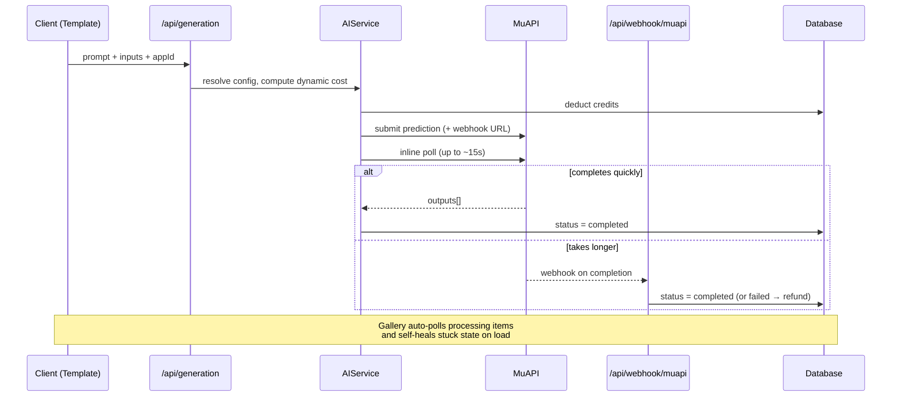

<!-- Banner (rendered live from URL — no download needed). Swap the text/colors freely. -->
<p align="center">
  
</p>

<h1 align="center">⚡ AI SaaS Studio — an AI App Builder & Launcher</h1>

<p align="center">
  A multi-tenant <b>Next.js</b> platform where you spin up branded, credit-metered AI apps
  (image · video · chat · audio) from a dashboard — then <b>export each one as its own
  standalone GitHub repo and Vercel deployment</b> in a single click.
</p>

<p align="center">
  <a href="#-getting-started"></a>
  <a href="#-export--deploy-standalone-apps"></a>
  <a href="#-license"></a>
</p>

<p align="center">
  
  
  
  
  
  
  
  
</p>

---

## 📖 Table of Contents

- [What is this?](#-what-is-this)
- [Screenshots](#-screenshots)
- [Key Features](#-key-features)
- [Tech Stack](#-tech-stack)
- [Architecture](#-architecture)
- [How Generation Works](#-how-generation-works)
- [The App Builder & Parameter Designer](#-the-app-builder--parameter-designer)
- [Export & Deploy Standalone Apps](#-export--deploy-standalone-apps)
- [Getting Started](#-getting-started)
- [Environment Variables](#-environment-variables)
- [Database Safety (Shared Supabase Pool)](#-database-safety-shared-supabase-pool)
- [Project Structure](#-project-structure)
- [Available Scripts](#-available-scripts)
- [Roadmap](#-roadmap)
- [Contributing](#-contributing)
- [License](#-license)
- [Author](#-author)

---

## 🧭 What is this?

**AI SaaS Studio** is not a single app — it's a **platform for building AI apps**.

Sign in, click **Launch New App**, pick a base template (Image, Video, Chat, or Audio), brand it,
wire it to any [MuAPI](https://muapi.ai) model, design the exact input form your users see, and set
per-input credit pricing. Each app you create gets its **own workspace, gallery, and pricing page**
at `/app/{id}`.

When an app is ready, hit **Deploy Standalone App** and the platform rewrites the codebase on the
fly — Prisma schema, model registry, AI service, navbar, theme — and **publishes it as a brand-new
GitHub repository** (optionally deployed to Vercel with environment variables forwarded).
One platform, infinite shippable AI products.

> **Use cases:** AI image generators · AI video studios · virtual try-on · AI photo editors ·
> companion chatbots · podcast/meeting transcribers · any credit-based generative-AI SaaS.

---

## 📸 Screenshots

> 🛠️ **Placeholders below** — drop your real captures into `docs/screenshots/` and update the paths.
> (I can capture these for you once the app is running locally — just ask.)

<table>
  <tr>
    <td width="50%"></td>
    <td width="50%"></td>
  </tr>
  <tr>
    <td align="center"><b>App Builder Console</b></td>
    <td align="center"><b>Launch Modal + Parameter Designer</b></td>
  </tr>
  <tr>
    <td width="50%"></td>
    <td width="50%"></td>
  </tr>
  <tr>
    <td align="center"><b>Generation Workspace</b></td>
    <td align="center"><b>Output Gallery</b></td>
  </tr>
</table>

---

## 🔑 Key Features

| | Feature | Description |
|---|---|---|
| 🏗️ | **Multi-tenant App Builder** | Launch unlimited app instances from 4 base templates — each isolated by `appId` with its own workspace, gallery & pricing. |
| 🎛️ | **Parameter Designer** | Visually build the input form your end-users see — text, textarea, number, slider, toggle, dropdown, and image/video/audio uploads with per-field upload limits. |
| 📥 | **JSON → Form Auto-detection** | Paste any sample JSON payload and the builder infers field types (URLs → media uploads, booleans → toggles, enums → dropdowns, etc.). |
| 💳 | **Dynamic Credit Pricing** | Set a base cost per app, then add cost-per-unit (sliders), cost-if-true (toggles), and per-option surcharges (dropdowns) — totals computed live. |
| 🤖 | **Unified AI Engine (MuAPI)** | One service drives image, video, audio and LLM generation via a single prediction API, with an offline mock mode when no key is set. |
| 🔄 | **Async + Self-Healing Delivery** | Inline polling for fast jobs, webhook completion for long ones, plus auto-reconciliation on gallery load so state never gets stuck. |
| 🔐 | **Google OAuth + Sessions** | NextAuth with the Prisma adapter, credits attached to every session. |
| 💸 | **Stripe Credit Packs** | Prebuilt Checkout for 4 credit tiers with webhook-backed top-ups and automatic refunds on failed generations. |
| 🎨 | **5 Built-in Themes** | `slate-indigo` (default), `cyberpunk`, `emerald`, `sunset`, `midnight` — applied per exported app via `data-theme`. |
| 🚀 | **One-Click Standalone Export** | Transform any app instance into its own GitHub repo + Vercel deployment, with the schema and AI service rewritten to match its custom parameters. |
| 🛡️ | **CORS-Safe Downloads** | Server-side `/api/download` proxy so generated assets download instantly across origins. |

---

## 🧰 Tech Stack

| Layer | Technology |
|---|---|
| **Framework** | Next.js 16 (App Router) · React 19 |
| **Styling** | Tailwind CSS v4 · React Icons · Framer Motion |
| **Database** | PostgreSQL (Supabase) · Prisma 7 (`@prisma/adapter-pg`) |
| **Auth** | NextAuth v4 (Google OAuth) + Prisma Adapter |
| **Payments** | Stripe Checkout + Webhooks |
| **AI Engine** | MuAPI (image / video / audio / LLM predictions) |
| **Notifications** | react-hot-toast |
| **Export/Deploy** | GitHub Git Trees API · Vercel REST API |

---

## 🏛️ Architecture

```mermaid
flowchart TD
    U[User / Browser] -->|Google OAuth| Auth[NextAuth]
    U -->|Launch & configure apps| Dash[App Builder Console<br/>src/app/page.js]
    Dash -->|CRUD| AInst[(AppInstance)]
    U -->|Generate| WS["Workspace /app/&#123;id&#125;<br/>Image · Video · Chat · Audio"]

    WS -->|POST /api/generation| Gen[Generation Route]
    Gen --> AIsvc[AIService]
    AIsvc -->|deduct credits| DB[(PostgreSQL via Prisma)]
    AIsvc -->|predict + webhook url| MuAPI[(MuAPI)]
    MuAPI -.->|inline poll / webhook| Hook[/api/webhook/muapi/]
    Hook -->|heal status| DB

    U -->|Buy credits| Pay[/api/checkout/]
    Pay --> Stripe[(Stripe Checkout)]
    Stripe -.->|checkout.session.completed| SHook[/api/webhook/stripe/]
    SHook -->|add credits| DB

    U -->|Deploy Standalone| Exp[/api/app-instances/export/]
    Exp -->|Git Trees API| GH[(New GitHub Repo)]
    Exp -.->|REST API| Vercel[(Vercel Deployment)]
```



---

## ⚙️ How Generation Works

A two-tier delivery model keeps the UI responsive for quick jobs while still handling slow ones — and
a reconciliation pass heals any prediction that slips through (handy in local dev where webhooks can't reach you).



If `MUAPIAPP_API_KEY` is unset, `AIService` returns a **mock completed generation** so you can develop the full flow offline.

---

## 🎚️ The App Builder & Parameter Designer

Every app instance stores a JSON `config` describing branding, model wiring, theme, and a list of
**custom input parameters**. The designer in the Launch modal lets you build that form visually, or
infer it from a sample payload.

**Paste sample JSON → get a form.** The detector maps:

| Detected from JSON | Becomes |
|---|---|
| Key contains `image`/`img`, or value is an image URL | **Image upload** (`image_list`) |
| Key contains `video`, or value is a video URL | **Video upload** (`video_list`) |
| Key contains `audio`, or value is an audio URL | **Audio upload** (`audio_list`) |
| `boolean` value | **Toggle** |
| `number` value | **Number input** |
| String with newlines | **Textarea** |
| Comma-separated / preset string (`Auto`, `1k`, `2k`, `4k`, …) | **Dropdown** (`enum`) |
| Key contains `_list` or value is an array | List input, default **max 5** uploads (1–50 configurable) |

**Per-parameter pricing** is summed live in the workspace button:
- Sliders / numbers → `costPerUnit × value`
- Toggles → `costIfTrue` when enabled
- Dropdowns → per-option surcharge

---

## 🚀 Export & Deploy Standalone Apps

The headline feature. **Deploy Standalone App** turns one app instance into a self-contained product:

1. **Scans** the platform source and keeps only the active template (e.g. only `ImageTemplate.js`).
2. **Rewrites** key files in memory:
   - `registry.js` → trimmed to the single active template
   - `standaloneConfig.js` → bakes in the app's name, template & config
   - `page.js` → becomes a single-app workspace (no builder dashboard)
   - `layout.js` → locks in the chosen `data-theme`
   - `schema.prisma` → **adds real DB columns** for each custom parameter
   - `ai.js` → persists those custom params on every generation
   - Navbar / gallery / pricing → rebranded to the app name
3. **Publishes** everything as a **single atomic commit** to a brand-new GitHub repo via the Git Trees API.
4. *(Optional)* **Deploys to Vercel**, creating the project, forwarding env vars, and triggering a build.

| Mode | Trigger | Result |
|---|---|---|
| ☁️ **Cloud export** | `GITHUB_TOKEN` set | New public GitHub repo (returns repo URL) |
| ☁️🚀 **Cloud + Deploy** | `GITHUB_TOKEN` **and** `VERCEL_TOKEN` set | GitHub repo **+** live `*.vercel.app` URL |
| 💾 **Local export** | No `GITHUB_TOKEN` (non-Vercel host) | Standalone app written to `../{slug}` on disk |

---

## 🏁 Getting Started

### Prerequisites
- **Node.js 18+** and npm
- A **PostgreSQL** database (Supabase recommended)
- **Google OAuth** credentials, a **Stripe** account, and a **MuAPI** key
  *(all optional for a first run — the app falls back to mock generation without a MuAPI key)*

### 1. Clone & install
```bash
git clone https://github.com/aozoragh/ai-saas-starter.git
cd ai-saas-starter
npm install
```

### 2. Configure environment
```bash
cp .env.example .env
# then fill in the values — see the table below
```

### 3. Sync the database
> ⚠️ Read [Database Safety](#-database-safety-shared-supabase-pool) first if you're on a shared Supabase pool.
```bash
npx prisma db pull      # introspect existing tables (shared DB)
npx prisma db push      # add this app's models without dropping others
npx prisma generate     # build the type-safe client
```

### 4. Run
```bash
npm run dev      # http://localhost:3000
npm run build    # production build (runs prisma generate first)
npm run start    # serve the production build
```

---

## 🔐 Environment Variables

| Variable | Required | Description |
|---|:---:|---|
| `DATABASE_URL` | ✅ | Pooled PostgreSQL connection string |
| `DIRECT_URL` | ✅ | Direct connection (used for migrations) |
| `NEXTAUTH_SECRET` | ✅ | Secret for encrypting NextAuth sessions |
| `NEXTAUTH_URL` | ✅ | Canonical app URL (e.g. `http://localhost:3000`) |
| `GOOGLE_CLIENT_ID` | ✅ | Google OAuth client ID |
| `GOOGLE_CLIENT_SECRET` | ✅ | Google OAuth client secret |
| `MUAPIAPP_API_KEY` | ⛔️* | MuAPI key (*omit to use offline mock generation) |
| `WEBHOOK_URL` | ⬜️ | Public base URL for async webhooks (defaults to `NEXTAUTH_URL`) |
| `STRIPE_SECRET_KEY` | ✅ | Stripe secret key |
| `STRIPE_WEBHOOK_SECRET` | ✅ | Stripe webhook signing secret |
| `NEXT_PUBLIC_STRIPE_PUBLISHABLE_KEY` | ✅ | Stripe publishable key |
| `GITHUB_TOKEN` | ⬜️ | Enables one-click **cloud export** to GitHub |
| `VERCEL_TOKEN` | ⬜️ | With `GITHUB_TOKEN`, also auto-deploys to Vercel |

### 💳 Credit Packs (configurable in `src/lib/config.js`)

| Pack | Credits | Price |
|---|---:|---:|
| Basic | 100 | $5 |
| Standard | 250 | $10 |
| Professional | 600 | $20 |
| Business | 2,000 | $50 |

> New users start with **10 free credits** (`User.credits` default).

---

## 🗄️ Database Safety (Shared Supabase Pool)

This app is designed to coexist in a **shared PostgreSQL database**. To avoid dropping other apps'
tables, follow this lifecycle whenever you change the schema:

1. **Pull first** — `npx prisma db pull` loads every existing table into `schema.prisma`.
2. **Declare your models** — add your tables (`AppInstance`, `Creation`, …) and relations.
3. **Push** — `npx prisma db push` adds your models *without* dropping the others.
4. **Clean up** — strip unrelated apps' models back out so your generated types stay lean.
5. **Generate** — `npx prisma generate` rebuilds the client.

> 🚫 Never run a destructive `migrate reset` against a shared pool.

---

## 🗂️ Project Structure

```
src/
├─ app/
│  ├─ page.js                    # App Builder Console (dashboard + launch modal)
│  ├─ layout.js · providers.js   # Root layout, theme, session provider
│  ├─ login/ · gallery/ · pricing/
│  ├─ app/[appId]/               # Per-instance workspace, gallery & pricing
│  └─ api/
│     ├─ app-instances/          # CRUD + export/ (standalone deploy)
│     ├─ generation/             # Submit a prediction
│     ├─ creations/              # List + self-heal status
│     ├─ checkout/ · upload/ · download/
│     └─ webhook/                # muapi/ + stripe/
├─ components/
│  ├─ Navbar.js · Footer.js
│  └─ templates/                 # Image · Video · Chat · Audio studios
└─ lib/
   ├─ registry.js                # Base template catalog
   ├─ config.js                  # App config, credit packs, AI defaults
   ├─ auth.js · prisma.js · stripe.js
   └─ services/                  # ai.js · billing.js · user.js
prisma/schema.prisma             # User · AppInstance · Creation · Account · Session
```

---

## 📜 Available Scripts

| Script | Action |
|---|---|
| `npm run dev` | Start the dev server |
| `npm run build` | `prisma generate` + production build |
| `npm run start` | Serve the production build |
| `npm run lint` | Run ESLint |

---

## 🗺️ Roadmap

- [ ] More base templates (TTS, music, 3D)
- [ ] Team workspaces & shared credit pools
- [ ] Usage analytics per app instance
- [ ] Subscription billing (in addition to credit packs)
- [ ] Export targets beyond Vercel (Netlify, Docker)

---

## 🤝 Contributing

Contributions are welcome! Fork the repo, create a feature branch, and open a PR.
For larger changes, please open an issue first to discuss what you'd like to change.

---

## 📄 License

Released under the **MIT License**. See [`LICENSE`](LICENSE) for details.

---

## 👤 Author

**Satoshi**

- GitHub: [@aozoragh](https://github.com/aozoragh)

<p align="center">
  <sub>Built with Next.js, Prisma, Stripe & MuAPI — ⭐ star the repo if it helped you ship.</sub>
</p>
